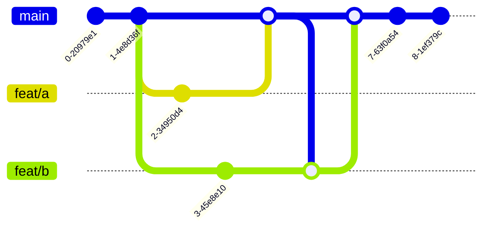

# hashdir

A CLI to calculate a single hash for the contents of a directory.

It uses the `xxh3` algorithm to calculate the hash of each file and it
respsects `.gitignore` files, thanks to the [`ignore` crate](https://github.com/BurntSushi/ripgrep/tree/master/crates/ignore).

```sh
hashdir dir
```

Is roughly equivalent to this bash one-liner:

```sh
find dir -type f -print0 | sort -z | xargs -0 sha1sum | sha1sum
```

## Why would you want to do this?

It can be useful to cache expensive operations when code hasn't changed.
For example, you could use this to cache test runs in a monorepo when other
parts of the codebase change.

Imagine you have a situation like the following:



You have a `main` branch and two feature branches `feat/a` and `feat/b`.
`feat/a` and `feat/b` operate on different parts of the codebase, so they
can't possibly generate conflicts.

You merge `feat/a` into `main` and then rebase or merge `feat/b` on top of `main`.
At this point your CI will run again, even though the code in `feat/b` hasn't
changed.

If you had a test report that matches the hash of the code in `feat/b` you could
skip running the tests again if the hash hasn't changed.
